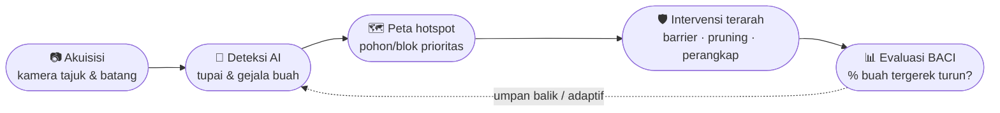
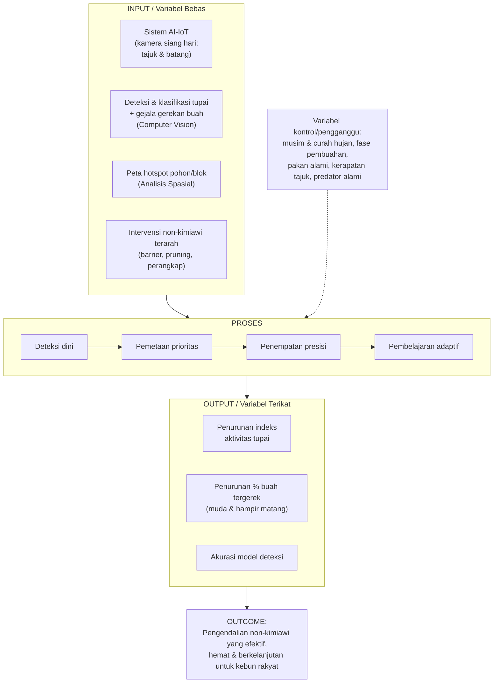
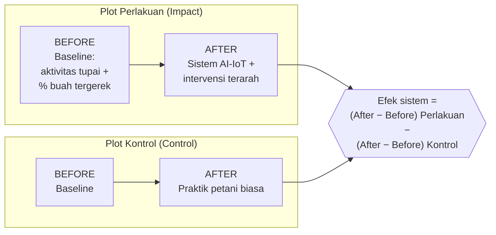
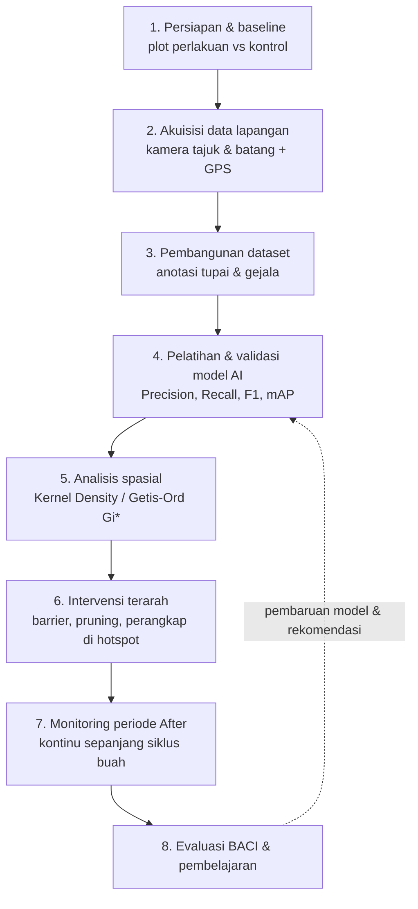

# Desain Penelitian (Concept Note)
## Smart Non-Chemical Pest Control Berbasis AI–IoT untuk Pengendalian Tupai Pemakan Buah pada Kebun Sawit Rakyat

> Dokumen ini disiapkan untuk dipresentasikan ke tim peneliti **sebelum** penyusunan proposal lengkap. Tujuannya menyepakati arah, ruang lingkup, dan desain metodologi agar proposal nantinya fokus dan tahan kritik reviewer.

---

### 1. Ringkasan Singkat (Abstrak Konsep)

Penelitian ini membangun sistem deteksi dini dan pengendalian non-kimiawi terhadap **hama tupai/bajing pemakan buah sawit** pada kebun rakyat. Tupai menyerang buah pada tandan **sepanjang perkembangannya — dari buah muda hingga mendekati matang — sebelum panen**, sehingga menurunkan hasil dan mutu TBS secara langsung. Sistem mengintegrasikan **kamera (akuisisi citra siang hari)**, **computer vision (deteksi & klasifikasi tupai serta gejala gerekan pada buah)**, dan **analisis spasial (pemetaan hotspot pohon/blok)** untuk mengarahkan **intervensi non-kimiawi terarah** (penghalang batang, pemutusan tajuk, perangkap). Efektivitas diuji dengan desain **BACI (Before–After–Control–Impact)** dengan membandingkan persentase buah tergerek dan indeks aktivitas tupai pada plot perlakuan vs kontrol.

**Inti kebaruan:** menggabungkan AI + peta hotspot untuk **mengarahkan pengendalian non-kimiawi tupai secara presisi** — area yang masih sedikit diteliti, berbeda dari pengendalian tupai yang umumnya merata dan kurang terdokumentasi.

**Pipeline sistem secara ringkas:**

---

### 2. Latar Belakang & Celah Penelitian (Research Gap)

- Tupai/bajing pemakan buah merusak buah sawit di tajuk **sebelum panen**, baik pada buah muda maupun yang mendekati matang, menurunkan hasil dan mutu TBS.
- Pengendalian di kebun rakyat masih bertumpu pada cara kimiawi/manual, bersifat merata, dan tidak terdokumentasi.
- Berbeda dengan tikus (yang punya solusi non-kimiawi mapan berupa burung hantu *Tyto alba*), **tupai belum memiliki solusi non-kimiawi tunggal yang sudah baku**, sehingga pengendalian cenderung coba-coba dan tidak terarah.

**Celah yang diisi:** belum ada sistem terjangkau untuk **mendeteksi dini, memetakan, dan memprioritaskan** lokasi pengendalian non-kimiawi tupai di skala kebun rakyat. Kombinasi AI-IoT + peta hotspot menawarkan pendekatan baru yang berbasis data.

> Catatan: efektivitas tiap metode non-kimiawi untuk tupai (Bagian 11) perlu diverifikasi ke literatur sawit terbaru sebelum masuk proposal, dan diposisikan sebagai sesuatu yang **diuji**, bukan sudah terbukti.

---

### 3. Ruang Lingkup & Batasan (PENTING)

Untuk menjaga penelitian tetap fokus dan dapat diselesaikan:

| Termasuk | Tidak Termasuk (di luar scope) |
|---|---|
| Satu hama fokus: **tupai/bajing pemakan buah** | Tikus, kumbang tanduk, ulat api, ulat daun (dapat jadi penelitian lanjutan) |
| Deteksi via kamera (citra siang hari) di tajuk & batang | Camera trap malam / sensor PIR sebagai komponen utama |
| Intervensi: penghalang batang, pemutusan tajuk, perangkap terarah | Kotak burung hantu, light trap, perangkap untuk serangga |
| Evaluasi BACI di lokasi terbatas | Klaim generalisasi nasional |

> Catatan tim: scope sengaja dipersempit dari poster awal (banyak hama + banyak intervensi) karena scope terlalu lebar adalah penyebab utama penelitian sulit selesai dan kritik reviewer.

---

### 4. Rumusan Masalah & Pertanyaan Penelitian

**Pertanyaan utama:** Apakah sistem AI-IoT yang mengarahkan penempatan pengendalian non-kimiawi secara presisi dapat menurunkan kerusakan buah akibat tupai secara signifikan dibanding praktik biasa?

Pertanyaan turunan:
1. Seberapa akurat model computer vision mendeteksi & mengklasifikasi tupai dan gejala gerekan buah dari citra kamera siang hari?
2. Bagaimana pola spasial-temporal hotspot serangan tupai (pohon/blok mana, pada tahap kematangan buah apa) di lokasi studi?
3. Apakah intervensi non-kimiawi terarah berbasis hotspot lebih efektif menurunkan persentase buah tergerek dibanding praktik biasa / kontrol?

---

### 5. Tujuan & Hipotesis

**Tujuan**
1. Membangun pipeline akuisisi–deteksi–pemetaan aktivitas tupai dan gejala gerekan buah.
2. Menghasilkan peta hotspot dan rekomendasi titik prioritas intervensi.
3. Menguji efektivitas intervensi terarah dengan desain BACI.
4. (Tambahan) Mengidentifikasi spesies tupai dominan sebagai salah satu output penelitian.

**Hipotesis (H1):** Plot perlakuan (intervensi terarah berbasis sistem) menunjukkan penurunan persentase buah tergerek dan indeks aktivitas tupai yang lebih besar dibanding plot kontrol pada periode After.

---

### 6. Kerangka Konseptual (Conceptual Framework)

---

### 7. Desain Penelitian: BACI

Desain **Before–After–Control–Impact** dipilih karena perbandingan "sebelum–sesudah" saja tidak bisa memisahkan efek intervensi dari variasi musiman/siklus hama dan fluktuasi pembuahan.

|  | Plot Perlakuan (Impact) | Plot Kontrol (Control) |
|---|---|---|
| **Before** | Ukur baseline (aktivitas tupai + % buah tergerek) | Ukur baseline |
| **After** | Sistem AI-IoT + intervensi terarah | Praktik petani biasa |

Efek sistem = perbedaan perubahan (After−Before) antara plot perlakuan dan kontrol. Idealnya ada **replikasi** beberapa pasang plot agar hasil tidak bergantung pada satu lokasi.

---

### 8. Alur Penelitian (Tahapan)

1. **Persiapan & baseline** — pemilihan & pemetaan blok, penetapan plot perlakuan vs kontrol, pengukuran % buah tergerek & indeks aktivitas tupai awal.
2. **Akuisisi data lapangan** — pemasangan kamera yang diarahkan ke **tandan di tajuk dan batang** (deteksi siang hari); pencatatan koordinat GPS tiap pohon/temuan.
3. **Pembangunan dataset** — seleksi, anotasi (bounding box tupai + gejala gerekan pada buah muda/matang), augmentasi; penetapan target jumlah citra & protokol anotasi.
4. **Pelatihan & validasi model AI** — deteksi/klasifikasi tupai & gejala; evaluasi akurasi (Precision, Recall, F1, mAP).
5. **Analisis spasial** — Kernel Density / Getis-Ord Gi* → peta hotspot pohon/blok → penetapan titik prioritas.
6. **Intervensi terarah** — pemasangan penghalang batang, pemutusan tajuk bersentuhan, dan perangkap pada pohon/blok hotspot (bukan merata).
7. **Monitoring periode After** — pengukuran ulang % buah tergerek & indeks aktivitas tupai secara **kontinu sepanjang siklus buah**.
8. **Evaluasi BACI & pembelajaran** — uji statistik perbedaan, interpretasi, pembaruan model/rekomendasi.

---

### 9. Variabel & Indikator Operasional

| Variabel | Indikator | Cara Ukur |
|---|---|---|
| Aktivitas tupai | Frekuensi deteksi/hari, jumlah tangkapan | Kamera + perangkap pada plot tetap |
| Kerusakan buah | % buah/tandan tergerek, **dipisah buah muda vs hampir matang** | Sensus tandan pada pohon contoh tetap |
| Akurasi deteksi | Precision, Recall, F1, mAP | Validasi dataset uji |
| Pola spasial | Lokasi & intensitas hotspot (pohon/blok) | GIS (Getis-Ord Gi*) |
| Efektivitas intervensi | Selisih perubahan perlakuan vs kontrol | Analisis BACI |

---

### 10. Lokasi, Populasi & Penarikan Sampel

- **Lokasi:** kebun sawit rakyat mitra (sebutkan kandidat lokasi & alasan saat presentasi).
- **Unit analisis:** pohon contoh / blok tetap.
- **Sampling:** plot dipilih purposif berdasarkan riwayat serangan (informasi mitra), lalu dipasangkan (perlakuan–kontrol) dengan karakteristik mirip (umur tanaman, topografi, kerapatan tajuk, kedekatan dengan vegetasi liar sumber tupai).
- **Catatan diskusi tim:** ketersediaan plot kontrol adalah syarat utama BACI. Bila tidak ada, desain diturunkan menjadi Before–After bertahap (lebih lemah) — perlu disepakati.

---

### 11. Instrumen & Teknologi

- **Akuisisi:** kamera diarahkan ke tandan/tajuk & batang (citra siang hari); GPS; (opsional sensor lingkungan).
- **Edge/komunikasi:** Raspberry Pi/Jetson; konektivitas 4G/WiFi untuk citra (LoRa hanya untuk metadata, bukan foto/video).
- **AI:** YOLO / RT-DETR / EfficientNet untuk deteksi-klasifikasi tupai & gejala gerekan.
- **Spasial:** QGIS / library GIS untuk hotspot.
- **Kandidat intervensi non-kimiawi (masih diuji, verifikasi literatur):**
  - **Penghalang batang (trunk barrier/banding)** — pelat licin/seng untuk mencegah tupai memanjat ke tajuk.
  - **Pemutusan tajuk bersentuhan (pruning)** — memberi jarak antar tajuk agar tupai sulit berpindah dengan melompat.
  - **Perangkap hidup terarah** — dipasang pada pohon/blok hotspot.
  - **Pengelolaan habitat / dorongan predator alami** — bukti lemah, diposisikan hati-hati.
- **Catatan realitas kebun rakyat (perlu dibahas):** sumber daya listrik (solar?), biaya per perangkat, jumlah perangkat per hektar, siapa yang merawat alat.

---

### 12. Strategi Dataset (titik kritis proyek)

- Target jumlah citra terlabel & sumbernya (lapangan sendiri + augmentasi).
- Protokol anotasi (tupai + gejala gerekan pada buah muda vs matang) & konsistensi antar-anotator.
- Keunggulan: tupai aktif siang hari → **citra terang & tajam**, lebih ramah untuk pelatihan dibanding citra malam.
- Penanganan kelas jarang & variasi sudut/oklusi tajuk; augmentasi pencahayaan/daun.
- Pemisahan train/val/test bebas kebocoran lokasi.

> Tanpa strategi dataset yang kredibel, klaim akurasi model akan diragukan reviewer.

---

### 13. Analisis Data

- **Model AI:** Precision, Recall, F1, mAP pada data uji.
- **Spasial:** Kernel Density, Getis-Ord Gi* untuk hotspot signifikan.
- **Efektivitas (BACI):** uji interaksi waktu×perlakuan (mis. mixed-effects / ANOVA BACI) pada % buah tergerek & indeks aktivitas tupai; analisis terpisah untuk buah muda vs hampir matang.

---

### 14. Luaran (Deliverables)

- Prototipe sistem AI-IoT deteksi tupai + dashboard hotspot.
- Dataset terlabel tupai & gejala gerekan buah sawit.
- Identifikasi spesies tupai dominan di lokasi.
- Peta hotspot & rekomendasi titik intervensi.
- Bukti efektivitas berbasis BACI.
- Publikasi ilmiah / laporan Grand Riset.

---

### 15. Timeline Ringkas (untuk disepakati)

| Fase | Aktivitas inti |
|---|---|
| Fase 1 | Persiapan, baseline, pemasangan perangkat |
| Fase 2 | Akuisisi data & pembangunan dataset |
| Fase 3 | Pelatihan model + analisis spasial |
| Fase 4 | Intervensi terarah + monitoring After (kontinu sepanjang siklus buah) |
| Fase 5 | Evaluasi BACI, pelaporan, publikasi |

*(Durasi tiap fase diisi sesuai kalender pendanaan dan siklus pembuahan.)*

---

### 16. Risiko & Mitigasi

| Risiko | Mitigasi |
|---|---|
| Konektivitas buruk untuk kirim citra | Edge processing + kirim metadata; sinkronisasi berkala |
| Dataset kurang / tidak seimbang | Augmentasi, transfer learning, perpanjang akuisisi |
| Intervensi non-kimiawi tupai belum baku / bukti terbatas | Uji kombinasi metode; posisikan sebagai temuan; ukur indikator antara (aktivitas tupai) |
| Tupai berpindah dari kebun tetangga | Catat kedekatan vegetasi sumber; pertimbangkan barrier di perimeter |
| Tidak ada plot kontrol | Turunkan ke desain Before–After bertahap (disepakati lebih awal) |
| Biaya perangkat tinggi untuk rakyat | Hitung model biaya & kepadatan deployment minimum |

---

### 17. Pembagian Peran Tim

| Peran | Anggota (Prodi) | Tanggung jawab |
|---|---|---|
| **Ketua + IoT/Hardware** | **Pak Adi** (Teknik Elektro) | Koordinasi tim & pendanaan; perangkat sensor & kamera, edge device, catu daya lapangan (mis. solar), konektivitas, keandalan elektronika |
| **AI/Computer Vision & Sistem** | **Aidil** (Sistem Informasi) | Pembangunan dataset, model deteksi/klasifikasi tupai & gejala gerekan, pipeline data, dashboard monitoring, integrasi sistem end-to-end |
| **GIS/Analisis Spasial** | **Pak Maryo** (PWK) | Peta hotspot (Kernel Density / Getis-Ord Gi*), penentuan pohon/blok prioritas, pemetaan & analisis pola spasial-temporal |
| **Infrastruktur Lapangan & Intervensi Fisik** | **Bu Oryza** (Teknik Sipil) | Desain & pemasangan penghalang batang, dudukan/struktur kamera, logistik instalasi, koordinasi pengukuran & sensus lapangan |

> **Catatan jujur (gap keahlian):** tidak ada anggota berlatar **agronomi/proteksi tanaman**. Validasi biologi tupai, identifikasi spesies, dan penilaian kerusakan buah sebaiknya didukung **mitra kebun** dan/atau **kolaborator agronomi eksternal**. Ini perlu disepakati di rapat agar klaim biologis & efektivitas intervensi tetap kredibel di mata reviewer.

---

### 18. Poin Keputusan untuk Rapat Tim

1. Konfirmasi fokus **tupai/bajing pemakan buah** sebagai hama utama.
2. Apakah plot **kontrol** tersedia → menentukan BACI penuh atau versi turunan.
3. Lokasi & jumlah plot/replikasi (berdasarkan info mitra).
4. Kombinasi intervensi non-kimiawi mana yang akan diuji (perlu cek literatur).
5. Target & sumber dataset.
6. Anggaran perangkat dan kepadatan deployment per hektar.